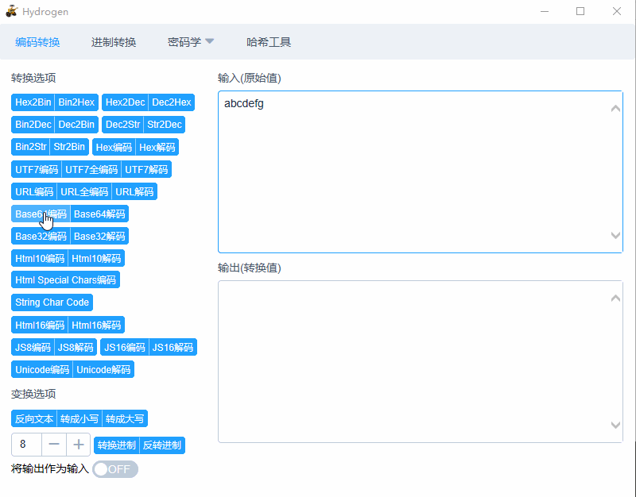

# hydrogen

在做 CTF 的过程中，有一些编码转换等功能经常要使用，但是网上的各种工具都没有较满意的，而且也不能自定义一些功能，因此就有了这样一个项目，类似的项目还有[CTFCrackTools](https://github.com/0Chencc/CTFCrackTools)。

这个工具使用了 Web 技术来实现，界面使用 Vue + Element 写的，后端使用了轻量级的 Web 框架 Bottle，在 Python 3 环境下，使用 [pywebview](https://github.com/r0x0r/pywebview) 实现窗口程序。

前端界面的项目地址: [hydrogen-fe](https://github.com/restran/hydrogen-fe)

[下载地址](https://github.com/restran/hydrogen/releases)



## 使用说明

Python 环境请使用 Python 3.5 以上

安装依赖

    pip3 install -r requirements.txt

Windows

    pip3 install pywebview[winforms]

Linux

    pip3 install pywebview[gtk3]

Mac

    pip3 install pywebview[cocoa]
    pip3 install PyQt5

在 hydrogen 目录下运行

    python3 server.py

然后打开浏览器，访问 127.0.0.1:8000 即可。若有端口冲突，请修改 settings.py 的配置


## 支持的功能

- 常见编码转换
- 文件转16进制/Base64
- 自动猜解字符编码 （WhatEncode）
- 常见古典密码解码
- AES/RSA 解码工具
- HTTP Proxy 工具（支持HTTPS，可以用 Python 编写一个拦截器），可搭配 BurpSuite 查看访问历史
- HTTP Repeat（自动解析请求包，实现重放请求，类似 BurpSuite Repeater）
- Hash 工具

### 生成CA证书

因为要桌 HTTPS 的抓包，需要生成自己的 CA 证书

```sh
openssl genrsa -out ca.key 2048
openssl req -new -x509 -days 3650 -key ca.key -out ca.crt -subj "/CN=Hydrogen CA"
openssl genrsa -out cert.key 2048
mkdir certs/
```

## 打包成可执行文件

### Build Windows Binary

Windows 环境下可以使用 pyinstaller 打包成一个文件，不显示控制台，设置图标

    pyinstaller --onefile --windowed --exclude-module=django --add-data="static;static" --add-data="ca;ca" --add-data="certs;certs" --add-data="templates;templates" --icon=assets/icon.ico main.py
    
如果遇到问题需要调试，可以显示命令行

    pyinstaller --onefile --exclude-module=django --add-data="static;static" --add-data="ca;ca" --add-data="certs;certs" --add-data="templates;templates" --icon=assets/icon.ico main.py

pywebview 2.0 以上版本

    pyinstaller --onefile --windowed --exclude-module=django --add-data="static;static" --add-data="ca;ca" --add-data="certs;certs" --add-data="templates;templates" --add-data "C:\Python36\Lib\site-packages\webview\lib\WebBrowserInterop.x64.dll;./" --add-data "C:\Python36\Lib\site-packages\webview\lib\WebBrowserInterop.x86.dll;./" --icon=assets/icon.ico main.py
    
### Build Mac Binary

Mac 环境下可以使用 [py2app](https://pypi.python.org/pypi/py2app/) 来打包，可以参考[这篇文章](http://www.jianshu.com/p/afb6b2b97ce9)。py2app 使用 0.14 和 0.15 版本打包有问题，可以降级到 0.12 版本。

py2app 提供了“别名模式”，该模式通过与开发文件象征性的链接构建应用，测试和开发的时候使用。

    python3 py2app_setup.py py2app -A

构建发布应用

    rm -rf build dist
    python3 py2app_setup.py py2app
    
图标要使用 icns 格式 [IconFinder](https://www.iconfinder.com/) 和 [freepik](http://www.freepik.com/free-icons) 下载

如果出现无法运行，需要进行调试，可以在打包后的程序，显示包内容，然后在命令行下面运行

    dist/Hydrogen.app/Contents/MacOS/Hydrogen

## 已知问题

### Windows 7 环境的问题

release 页面的 Windows 可执行程序，目前是在 Windows10 环境下用 pyinstaller 打包生成的，在 Windows 7 下可能会遇到 `Fail to execute script main` 的问题。在这种情况下，可以尝试使用源代码的方式执行。

### 内存占用问题

运行 pyinstaller 和 py2app 打包好的文件，在使用过程中，会出现内存一直上涨的问题，这个问题应该是 pywebview 本身的问题，目前暂无有效解决方法，建议在不用的时候关掉程序。

## 类似项目

- [CTFCrackTools](https://github.com/0Chencc/CTFCrackTools)

## 致谢

- phith0n: [tool-playground](https://github.com/phith0n/tool-playground)
- hustcc: [xmorse](https://github.com/hustcc/xmorse)
- 5alt: [tornado-proxy](https://github.com/5alt/tornado-proxy)
